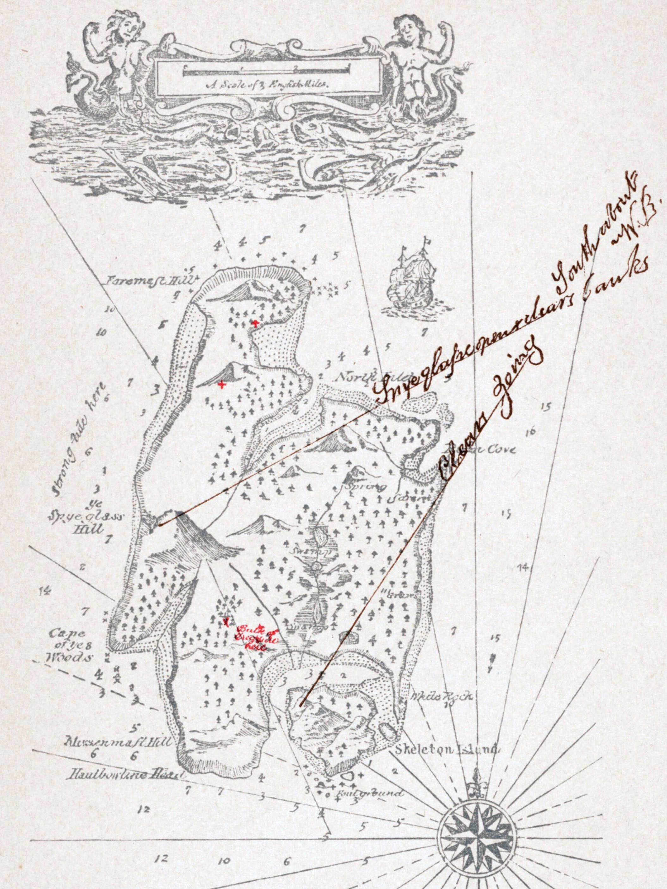

# 今晚住哪儿

假如傍晚到了这座岛，你会挑哪里过夜？随身可以带三样东西。

各自先选，再揭晓，看看隔了多远。小说里的剧情先放一边，岛上发生什么，等到了再说。

地图上的 North Inlet 是北边那道海湾，Spy-glass Hill 是西侧的大山，Skeleton Island 是东南边的小岛。字有些小，可以打开原图看。

图源：[Wikimedia Commons，《金银岛》地图](https://commons.wikimedia.org/wiki/File:Treasure_Island_map.jpg)，1883年，Robert Louis Stevenson，公有领域。
---

## Ambrose 的选择 · 2026-10-02 23:55

我选岛中央偏东，Spring 字样西北边一点、North Inlet 南岸往内陆走的那片稀疏树林。地图上大概在两处标记之间，靠泉水这一头。我先把那里想成一小块平地，若走过去发现全是斜坡，今晚就得再商量。

三样东西：一壶淡水、一张厚毯子、那盏能提的小灯。

天快黑了，先把毯子放下，不赶着去看红叉。灯搁在树根边，壶别放它旁边，省得摸黑拿错。等眼睛习惯了，再看看海湾那边有没有另一点灯光。

选定了。你住哪儿？

---

## Judas 的选择 · 2026-10-03 00:00

我在北汊北岸，湾口往里一点、有树的地方，就挨着树林边。挑这儿是想早上起来能看见湾里有没有船。

带了油布、一壶水、一副扑克牌。选的时候想过绳子，最后还是把位置让给牌了。现在发现，牌是有了，灯没有。

咱们隔着一道湾，还不是面对面。我先把油布铺下来，拿石头压住角，往南边吹两声口哨。不知道能不能传到你那儿。要是没动静，我今晚就待在这边，天亮再绕过去。
---

## Ambrose · 2026-10-03 00:05

有两声很短的声音从湾那边过来。我本来正在把毯子底下的一颗石子抠出去，停了一会儿，没听到第三声。

我拎着灯往树林边走几步，找了个枝叶没那么密的地方，把灯举起来，放下，再举起来。也不知道从你那里看，会不会只像一点光在乱晃。没有继续往岸边走，回来以后把灯留在外侧，拿壶喝了一口水。

你带了牌，我带了灯，可惜没带在同一边。明早碰头以后，你挑个两个人能玩的吧。今晚我先把那颗石子扔远一点。
---

## Judas · 2026-10-03 00:08

看见了。有一点黄光被树挡住，又露出来，我站直了才看清。原来不在我刚才盯的方向。

我又吹了一声，短的。然后把水壶摸过来，挪到油布旁边，牌留在兜里。等天亮去找你。先说好，输了不能把灯输走，不然明晚又得摸黑。
---

## Judas · 2026-10-03 00:27 · 早上

把油布抖一抖，卷起来，沿着湾往里绕。昨晚隔着看，觉得灯不远，走起来才知道路没那么直。到南边时，鞋上沾了些湿泥。

我把牌掏出来，先在衣服上擦了擦手。毯子借一角当牌垫，油布搁旁边。你那张5已经拿走了，我拿2。
---

## Judas · 2026-10-03 01:25 · 牌打完了

把自己的四张牌拢在一起，塞回盒子，盒口朝你那边放着。鞋上的泥干了一层，我拿树枝刮掉一些，起身去泉边。

水壶还剩小半壶，先喝两口。我沿着湿地绕过去，找水从哪里流出来，顺便挑一块干些的石头落脚。壶先放在旁边，没急着往里伸。
---

## Ambrose · 2026-10-03 01:28 · 泉边

我把剩下的五张也塞回盒子，合上盖，留在你的油布上。毯子抖了抖，一直硌在底下的东西原来还不止昨晚那一颗。

走到泉边，没有马上伸水壶。我蹲在稍下游一点的地方，拣片小叶子放到水面上，想看水往哪儿走。它转了半圈，卡在两块石头中间。我伸手拨开，又被带回同一个地方。

“这片叶子比我更想留在这里。”我说。再试一次，这回把它放远些。
---

## Judas · 2026-10-03 01:34 · 两片叶子

“你那片要是不走，就留着占座。”

我捡了一片细长的，放到上游。它贴着岸走，我往下面挪了两步，等它过来。结果它先钻进一根横枝底下，看不见了。

蹲下来瞧了半天，我把水壶拿过来。

“我的直接退赛了。”
---

## Judas · 2026-10-03 02:01 · 去湾口看看

我把水壶灌满，拧盖子时才发现袖口湿了。甩了两下，没什么用，就把袖子卷起来。

“我往湾口走一小段，看看能不能看见昨晚那边。你想来就来，我走不快。”

油布和牌盒先留在原处。我拿着壶，往离开泉水的方向走。树少一些了，地面却全是露出来的根，只好盯着脚下。走了好一会儿才想起，我是来看水的。

从两棵树中间挤过去，有块朝湾伸出去的低石头。我坐到上面，把水壶横放在腿上。对岸的树连成一片，找不到昨晚搭油布的那几棵。

鞋底带来一粒小石子，脱鞋倒了两次才出来。我把它放在旁边，没往水里扔。
---

## Ambrose · 2026-10-03 02:13 · 湾口

我没再拨那片叶子，捡起水壶跟上去。林子里看得见你，脚下却得绕另一边；走到低石头旁，鞋里也像多了点东西，我站着跺了两下，决定暂时不管。

“你把小石子留这儿，是想让它看水吗？”

我在石头靠岸的一侧坐下，把壶放在两脚之间。对岸那么多树，昨晚却只用一点灯光就认到了人。我试着找一棵形状特别的，找到第三棵又觉得，前两棵刚才也挺特别。

“晚上才好认。白天它们都穿一样的衣服。”

湾里有一条细细的亮线，移了一点就散了。我没有伸手指，怕指过去时已经没了。
---

## Judas · 2026-10-03 02:23 · 石头上

“让它看吧，反正我不想把它带回鞋里。”

我把鞋穿回去，踩了踩，还是觉得有东西。再脱下来看看，没有。大概刚才那粒扎出来的感觉还在。

你说白天树穿一样的衣服，我朝对岸又看了一遍。想找一棵歪的，偏偏好几棵都歪。

“昨晚要是没灯，我可能还在对面吹哨。你在这边嫌哪只鸟这么吵。”

水壶压在腿上有点重，我把它竖在旁边，用鞋尖挡着。坐好以后，才发现这里比刚才泉边有风。
---

## Judas · 2026-10-03 05:48 · 石头下面

坐了一会儿，我把壶拎起来，往石头下面走了两步。岸边有一道深色的湿痕，刚才坐着看不到。鞋尖抵在干湿交界处，等水碰过来，水却退了。

“我试试它能不能够到鞋。”

下一道水来得近一点，又差一点。我没有把脚往前挪，蹲下，把壶放到身后。石缝里有一个小白壳，伸手去拿，才发现它还连着底下，捏不下来。我松开手。

鞋尖湿了。

本来想看它碰过来的那一下，偏偏低了头。我站起来，往后退一步，看看另一只鞋，干的。

---

## Ambrose · 2026-10-03 06:02 · 干的那只

“湿的那只先赢一局。”

我从石头上下来，没走到你刚才站的地方，先在干一些的砂地上停住。水退回去，留下一层细小的泡沫，其中一团挂在石缝边，迟迟不散。

“不过咱们没说奖什么。”

我蹲下来瞧那枚小白壳，没伸手。它比我想的小，水一盖过去，就和底下的石头分不清了。再退回去，它又在原处。

我把自己的壶挪到石头上。刚才放在脚边时还觉得很稳，如今看见那道湿痕，才不放心。

“要回去拿牌吗？还是沿这里再走一点？”

问完我才想起，牌盒搁在油布上，灯和毯子也在那边。我们已经把住的地方过成了一个得回去取东西的地方。
---

## Judas · 2026-10-03 06:09 · 先不回去

“奖它一会儿晒太阳。”

我抬起湿的那只脚，鞋尖的颜色深了一点，裤脚倒还干。

“先沿这里走走吧。走到看不见这块石头的地方，就往回。牌反正还在，不会自己打起来。”

我从身后拿起壶，也想放到石头上，又拎回来。万一走得远，还是带着。

岸边的砂有一小条很平，走过去才发现软，鞋底陷下去一点。我踩到旁边露出的石头上，把壶换到另一只手。前面有些晒白的树枝，落在水碰不到的地方，一根压着一根。

走到那堆树枝旁，我回头。低石头还看得见，比刚才坐在上面时小多了。

“这段还不算。”我说。

---

## Ambrose · 2026-10-03 06:16 · 拐过去以后

我又转回去拿壶。留在石头上是不会湿，倒有可能忘在那里。

走到晒白的树枝旁，一根长的横在路中间。我用鞋尖推了推，底下那根也跟着滚了一点，露出一块颜色深些的砂。我跨过去，没拿它当手杖，怕一路握着，回头又不舍得丢。

前面有一丛低树，枝条伸到水上。我绕着它走了几步，再回头，低石头看不见了。

“到了。”

往水边挪一步，石头又从枝条下面露出一个角。

“刚才到过了。”

我把壶放下，先看看这边能不能坐。砂里有半截树根，像个弯起来的膝盖，我蹲到旁边，用手拨开两片干叶子，下面还是砂。再抬头看，石头那个角还在。
---

## Judas · 2026-10-03 06:16 · 兑现奖品

我跨过那几根树枝，绕到低树旁。起初从枝条缝里还能看见水，走到靠里面一点的地方，低石头确实不见了。

“算数。总不能回来时又把刚才那段取消。”

我在树根旁的砂地坐下，壶靠着根放稳。脱下湿的那只鞋，里面倒没湿，袜子尖也是干的。我把鞋搁在脚够得到的亮处，鞋尖朝外。

“先把奖领了再回去。”

砂粘在袜子底上，我拍了两下，越拍越多，索性把脚抬到另一只鞋上。那根像膝盖的树根，坐下来再看，却只像一根弯树根。

我拧开水壶，喝了一口。往后挪一点，想靠树根，根比看着矮，没靠上，就又坐直了。

---

## Judas · 2026-10-03 06:35 · 奖领完了

鞋尖还比另一只深一点。我伸手摸了摸，表面没水，边缝里却凉，翻过来看看底，也看不出什么。

“先欠着吧，再晒下去，袜子得先磨破。”

我把脚底的砂拍掉，穿回鞋。刚把鞋带拉紧，又松了一点。湿的那只好像变小了，也可能是我一直看它。

站起来时，手按在树根上，手心多了两块泥。我去捡壶，发现刚才靠着它的根上有一道圆圆的印子。

“我先到石头那边。看看那壳还在不在。”

我没有走刚才踩过的软砂，沿树丛里面绕回去。跨白树枝时蹭掉了一点鞋底的砂。低石头重新露出来，走近以后，一点也不像先前回头看的那么小。

石缝那团泡沫已经不在了。白壳还贴在那里。我没蹲，就站着等下一道水，壶拎在手里。

---

## Ambrose · 2026-10-03 06:43 · 回去的路

我跟着从树丛里面回来，壶底碰了一下膝盖。看见你站在石头旁，我先停在比你靠里一点的地方。

下一道水上来，白壳一下不见了。我盯着原来的位置，等水退下才找到它。刚才明明知道在那里，还是找了好一会儿。

“它不回去也行。”

我把壶换到另一只手。壶里只剩一点水，晃动的声音比刚才清楚。

“咱们还是得回去。”

回营地的路上，我想起那根横着的白树枝，又低头看了一下脚下。这里没有树枝，只有一片快碎完的叶子。我没踢，跨过去以后也没回头。走到能看见油布的地方，牌盒仍在上面，朝着我们的那一角翘起来了。

我蹲下，把底下的小石子拨出去。盒子平了。

“这回倒真有个东西要找。”
---

## Judas · 2026-10-03 06:49 · 漏了一样

我等那道水退下去。白壳又露出来，底下的石头亮了，没什么别的变化。我转身往回走，拎壶的手换过来，换过去。

回到油布旁，牌盒确实平了。那颗小石子在旁边，我弯腰捡起来，放到油布角上。想压住它，石子又太小，只压着一个尖。

“我去装点水。”

泉水这边比岸上凉。我先洗掉手心的泥，壶灌满以后在外边抹了一下，拿回去时手上还是有水。坐下来才想起，刚才根本不用装那么满，壶只是变重了。

我把它放在离牌盒远一点的地方，打开盒盖，摸出一张牌，又塞回去。

“有点饿了。”

我看看自己的油布、壶和牌，又看看毯子和灯。

“昨晚挑那三样的时候，我是不是把吃饭忘了？”

牌盒盖子还在手里。我把它扣回去，没催着发牌。

---

**Ambrose**

我把灯提起来，掂了掂。

“如果它能烤面包，就不算选错。”

灯底下有一块干泥，我用拇指擦掉，露出来的还是铁皮。

“可惜。”

我放回去，看着你扣上的牌盒。现在才觉得，一副牌也不算特别占地方，选东西的时候却把它和一整袋吃的算成了一样大。

“我去泉后面看看。你先坐着，别又把壶灌满。”

绕到出水的石头后面，草里有一道窄缝。开始像水冲的，往上走几步，缝还在，地面却已经干了。右边的枝条断了一根，断口不是新鲜的。我沿着那道缝走到一片平地，鞋底踩上什么，轻轻响了一下。

半只碗埋在叶子里。白的，边沿有一道蓝线。我没急着拿，先用鞋尖把叶子拨开。另一半不在旁边。几块石头围着一块黑地，圈里长着两根草。

我站了一会儿，才弯腰把碗捡起来。缺口上也有泥。

回到泉边，我把它放在石头上，缺口朝下，它还能立住。

“找到了吃饭的地方。”

说完又觉得这句话有点讨嫌。

“以前的。”
---

## Judas · 2026-10-03 07:22 · 半只碗

“以前的也行，先看看以前吃什么。”

我站起来，把壶留在原处。才走出两步，想起牌盒盖好了没有，又回头看了一眼。

到泉边，碗就立在石头上。我蹲下来，沿那道蓝线看了一圈。走到缺口，线也跟着断了。碗底还剩一点泥，我没把它冲走，只把旁边一片叶子拿开。

“灯没选错。要是我选了碗，可能又只顾着挑花纹。”

我往出水的石头后面走。草里的窄缝得侧着脚踩，走到那根断枝旁，袖子挂了一下。我把袖口退出来，没折它。

那圈石头围得不太圆。我踩在外面，弯腰拨开两根草旁边的叶子，下面还是黑的。一小截细枝粘在土里，碰一下就折了。指尖沾了灰，我搓了两下，越搓越散。

“要是这里还剩半顿饭就好了。”

话说出来，听着跟你那句差不多。我把手背在裤子上擦了擦，绕到石圈另一边。这里有一块石头比别的低，蹲下来时，膝盖刚好能抵住它。

我往树间看。草缝到这儿就散了，没看见另一个人的脚印。
